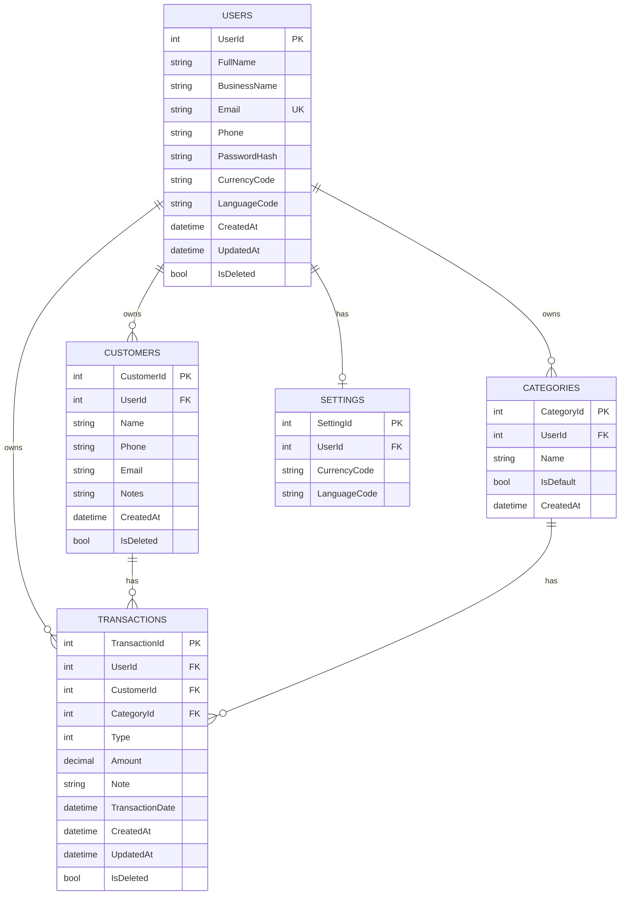

# HisabDo Web API - Database ERD

Initial entity relationship diagram for the HisabDo web application (v1).



## Relationships

```text
User     1 --- * Customer        (one user has many customers)
User     1 --- * Transaction     (one user has many transactions)
User     1 --- * Category        (one user has many categories)
User     1 --- 1 Setting         (one user has one settings row)
Customer 1 --- * Transaction     (one customer has many transactions)
Category 1 --- * Transaction     (one category has many transactions)
```

## Notes

- Every business table has `UserId` so each user only sees their own data.
- `Type` in Transactions: 1 = Receivable, 2 = Payable.
- Soft delete: `IsDeleted` flag instead of hard delete.
- Reports are calculated from Transactions, not stored.
